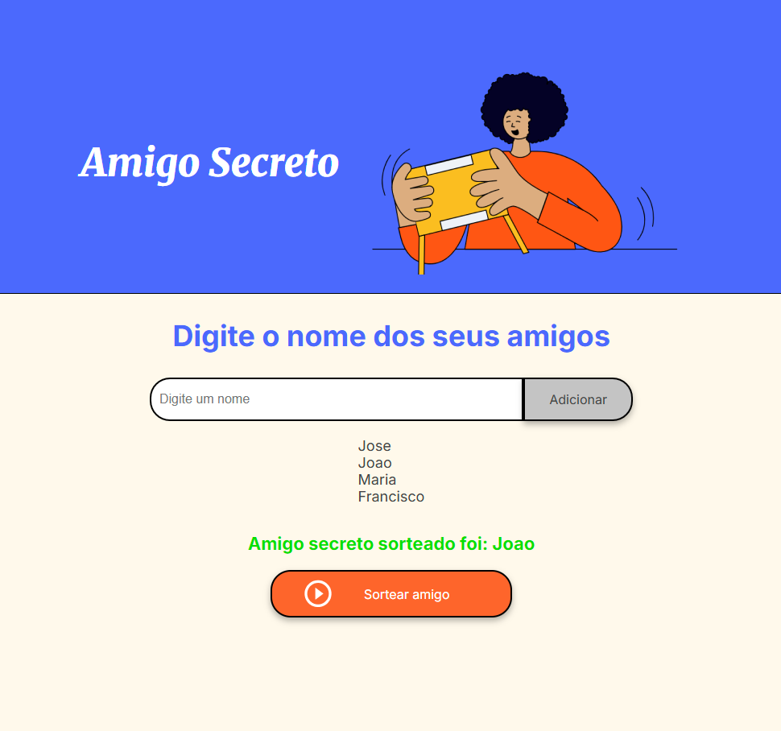

# 🎁 Projeto Amigo Secreto

Este é um projeto simples em HTML, CSS e JavaScript que permite criar uma lista de nomes e sortear um participante como "Amigo Secreto".

---

## 📸 Demonstração

### 🔤 Adicionando nomes


### 🎲 Sorteando o amigo secreto


---

## 🚀 Funcionalidades

- ✅ Adicionar nomes de participantes manualmente
- ✅ Visualizar a lista de nomes inseridos
- ✅ Validar entradas vazias
- ✅ Sortear aleatoriamente um nome da lista
- ✅ Exibir o resultado do sorteio
- ✅ Interface responsiva e visual agradável

---

## 🧠 Tecnologias utilizadas

- HTML5
- CSS3
- JavaScript (Vanilla)

---

## 🗂️ Estrutura do projeto

```bash
📁 amigo-secreto/
├── 📄 index.html
├── 📄 style.css
├── 📄 app.js
└── 📁 assets/
    ├── amigo-secreto.png
    ├── demo-adicionar-nome.gif
    └── demo-sortear.gif
